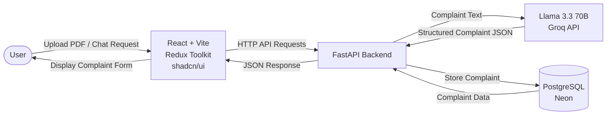

# AIVOA Complaint Backend

Backend service for an AI-powered Pharmaceutical Quality Management System (QMS) Customer Complaint module.

The backend extracts structured complaint information from pharmaceutical complaint documents using an LLM, supports AI-assisted complaint updates through natural language, and stores approved complaints in PostgreSQL.

---

## System Architecture



---

## Features

- AI-powered complaint extraction from PDF documents
- AI-assisted complaint updates using natural language
- Automatic extraction of:
  - Customer Name
  - Complaint Source
  - Product Name
  - Product Strength
  - Batch Number
  - Manufacturing Date
  - Expiry Date
  - Complaint Type
  - Complaint Description
  - Quantity Affected
- AI-generated:
  - Severity
  - Priority
  - Suggested Action
  - Risk Assessment
- Complaint persistence in PostgreSQL
- RESTful APIs built with FastAPI
- Interactive Swagger API documentation

---

## Tech Stack

- Python
- FastAPI
- SQLAlchemy
- PostgreSQL (Neon)
- Groq API
- Llama 3.3 70B Versatile

---

## Project Structure

```text
app/
├── ai/
├── api/
├── db/
├── graph/
├── models/
├── pdf/
├── schemas/
└── main.py
```

---

## Setup

### Clone Repository

```bash
git clone https://github.com/Paresh-29/aivoa-complaint-backend.git
cd aivoa-complaint-backend
```

### Create Virtual Environment

```bash
python -m venv .venv
```

Linux / macOS

```bash
source .venv/bin/activate
```

Windows

```bash
.venv\Scripts\activate
```

---

### Install Dependencies

```bash
pip install -r requirements.txt
```

---

## Environment Variables

Create a `.env` file in the project root.

```env
DATABASE_URL=your_neon_database_url
GROQ_API_KEY=your_groq_api_key
```

---

## Initialize Database

```bash
python -m app.db.init_db
```

---

## Run the Development Server

```bash
uvicorn app.main:app --reload
```

The backend will be available at:

```text
http://localhost:8000
```

---

## API Documentation

Swagger UI

```text
http://localhost:8000/docs
```

ReDoc

```text
http://localhost:8000/redoc
```

---

## Application Workflow

1. Upload a pharmaceutical complaint PDF.
2. Extract complaint text from the document.
3. AI converts the complaint into structured JSON.
4. Review the generated complaint form.
5. Update complaint details using natural language chat.
6. Commit the approved complaint to PostgreSQL.

---

## AI Capabilities

The application uses **Llama 3.3 70B (Groq)** to:

- Extract structured complaint information from PDF documents
- Identify Product Name and Product Strength separately
- Identify Complaint Source
- Generate Severity and Priority
- Generate Suggested Action
- Generate Risk Assessment
- Update complaint information using natural language instructions

---

## Author

**Paresh Barick**